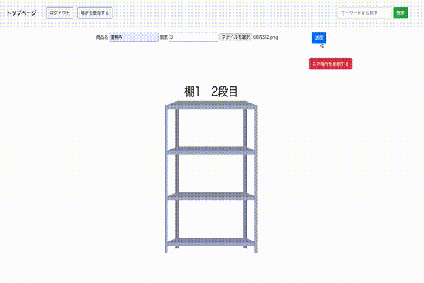

# README
# dokosukagram

## どこに何があるかを探す手間や、時間を節約したい
- 開発の経緯

  このアプリを開発した経緯は、どこに何があるかを探す手間や、時間を節約するためです。 
  前職では多種多様な塗料を扱っており、保管場所も技術室や倉庫などに分かれており、 
  塗料が入っている容器も一斗缶や瓶、ポリタンクなど様々あり、探しづらいという難点がありました。 
  そのため、塗料を探す人が現場から一人抜け、探している間誰かがその穴埋めをしなければならないので 
  作業効率が落ちるという問題がありました。 
  以上のことから、探す時間のロスを削減できるアプリを作ろうと思いました。 

- 工夫した点

  どんな人でも使いやすいように機能をシンプルにし、無駄な修飾を省き、見やすさを重視しました。

***デモ***
## ログイン

## 場所の登録

## 商品の登録

## 商品の検索

## 機能

- ユーザー登録
- 場所の登録
- 商品の登録
- 検索機能

## デプロイ

1. Heroku(https://docosukagram.herokuapp.com/) 
- ログイン時は下記を入力してください
メールアドレス: 1@1 
パスワード: ccc111

## その他
使用言語 HTML/CSS,Ruby,Javascript
使用フレームワーク Ruby on Rails,BootStrap

